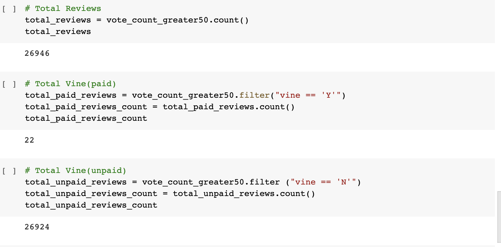
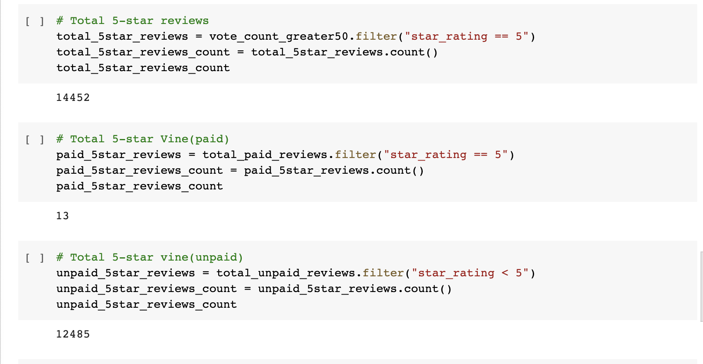
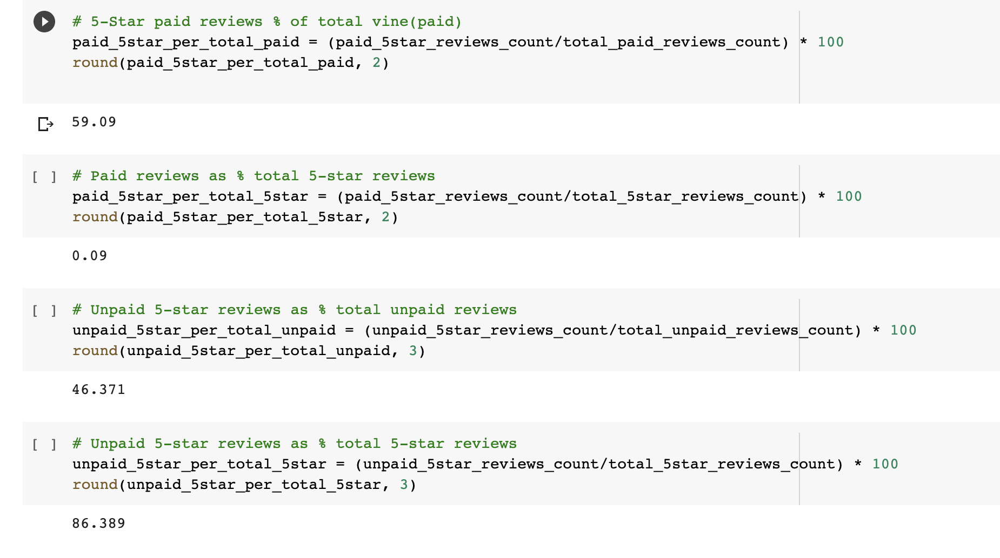

# Amazon Vine Analysis

## Overview of the Analysis

The purpose of this assignment was to learn what constitutes big data and how it is handled. The task led to analyzing Amazon reviews written by members of the paid Amazon Vine program. The goal was to determine if there was any bias in relation to favorable reviews from Vine members in the dataset.

A dataset containing Amazon reviews of a specific product (shoes in this case) was provided. PySpark was used to perform the ETL process and to connect the data to an AWS RDS instance. After the data was transformed, it was loaded into pgAdmin.  In order to analyze the data, we used the following resources: 

- Spark to handle large Datasets
- Spark DataFrames and functions in Google Colab Notebooks
- Cloud Databases with Amazon Web Services
- Cloud Storage with S3 on AWS
- PySpark to perform ETL
- PostgreSQL

## Results

Using the above resources, the product reviews were counted and grouped by star ratings. The analysis found the following:

***How many Vine reviews and non-Vine reviews were there?***

- There were 26,946 reviews in total. Out of that total, 22 were Vine (paid) reviews, and 26,924 non-Vine (unpaid) reviews. 

***How many Vine reviews were 5 stars? How many non-Vine reviews were 5 stars?***

- There was a total of 14,452 5-star reviews. Out of that total, 13 were 5-star Vine reviews, and 12,485 were 5-star non-Vine reviews.

***What percentage of Vine reviews were 5 stars? What percentage of non-Vine reviews were 5 stars?***

- The percentage of total 5-star Vine reviews of total Vine reviews was 59%
- The percentage of 5-star Vine reviews of total 5-star reviews was 9%

- The percentage of total 5-star non-Vine reviews of total non-Vine reviews was 46% 
- The percentage of 5-star non-Vine reviews of total 5-star reviews was 86%

## Summary

The results from the analysis seem to suggest that there was not a very strong bias towards the Vine program. Looking at the percentages, we can see that out of the total 5-star reviews only 9% represent the Vine 5-star reviews. In other words, the total 5-star reviews was 14,452, and of that total only 13 reviews were part of the Vine program. The percentage of total 5-star Vine reviews of all Vine reviews was 59%. Although it was a little more than half of reviewers, is was not strong enough to state there was a positivity bias.

In general, individuals write a review because they absolutely love the product, or truly dislike the product, especially regarding shoes. One additional analysis that I would recommend to fully support the analysis is counting the total of women and men in the Vine program. Generally, women tend to love and buy more shoes than men, and also tend to express their honest opinion regarding fit and comfort. Because there was not gender information provided for this analysis, these numbers may not be an accurate representation of the product's reviews, or distribution of the data. Additionally, the results of the analysis could be further  examined by looking at the distribution of star-ratings from one to five.
